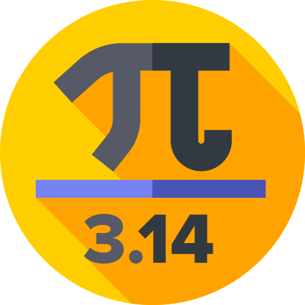

  

    
<h1 align="center">
  <h2 align="center"><strong align="center">Projeto <math>&pi;</math></strong></h2>
</h1>

 

<h2> Descrição </h2>

  Uma demonstração da aproximação do valor de <math>&pi;</math> através do <a href="https://pt.wikipedia.org/wiki/M%C3%A9todo_de_Monte_Carlo" target="_blank" title="Método de Monte Carlo"> método de Monte Carlo</a> usando o <a href="https://p5js.org/" target="_blank" title="p5.js"> p5.js</a>.

 

<h2> Agradecimentos </h2>

<ul>
  <li><a href="https://shiffman.net/" target="_blank"> Daniel Shiffman </a></li>
</ul>

  
    <adress>
      Icons made by (from <a href="https://www.flaticon.com/br/" target="_blank" title="Flaticon"> Flaticon</a>):
      <ul>
        <li><a href="https://www.flaticon.com/br/autores/freepik" target="_blank" title="Freepik">Freepik</a>;</li>
      </ul>
    </adress>
  

 

<h2> Autor </h2>

<table>
  <tr>
    <td align="center"><a href="https://www.linkedin.com/in/vini-antunes/" target="_blank"> <b>Vini Antunes</b></a> </td>
  <tr>
</table>

 

