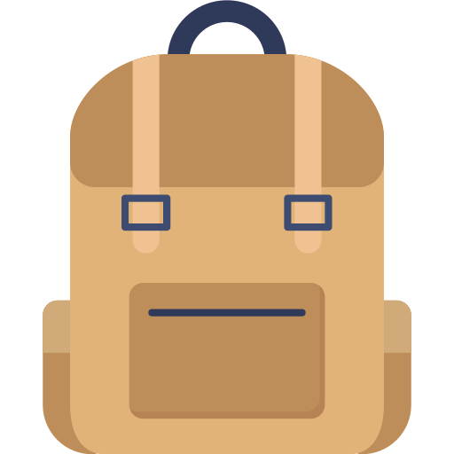

  
  

    
<h1 align="center">
  <h2 align="center"><strong align="center">Projeto Mochila de Criança</strong></h2>
</h1>

 

<h2> Descrição </h2>

  Para você que vai viajar e não quer esquecer nada, o projeto Mochila de Criança é ideal. Nele você adiciona e remove itens que quiser.

  Um projeto para praticar o armazenamento de dados no navegador via <code>localStorage</code>.

  <ul>
    <li>
      <strong><code>localStorage</code></strong> guarda informações de forma persistente no navegador, sendo em média 5MB de armazenamento padrão, podendo variar dependendo do navegador utilizado. Este limite pode ser aumentado pelo usuário quando necessário, no entanto apenas alguns navegadores suportam isso. Os dados salvos são apenas do tipo <code>string</code> texto.
    </li>
    <li>
      <strong><code>Cookies</code></strong> guardam informações de forma persistente no navegador, sendo até 4KB de armazenamento por Cookie, bem menos que <code>localStorage</code>. Cada cookie é como se fosse um arquivo criado que guarda as informações de acesso da pessoa usuária, por exemplo, de qual local o site foi acessado, qual e-mail foi utilizado ao realizar login no navegador, e quais produtos de um site foram clicados. Para acessá-los, muitas empresas criam pop ups para confirmar a autorização do uso dessas informações, pois são consideradas sensíveis.
    </li>
    <li>
      <strong><code>sessionStorage</code></strong> é similar ao <code>localStorage</code>, sua diferença é que os dados não são salvos de forma persistente, ou seja, ao fechar o navegador eles são perdidos. Este tipo de armazenamento é utilizado quando queremos que a pessoa usuária utilize os dados apenas enquanto estiver com o site aberto.
    </li>
  </ul>

 

<h2> Agradecimentos </h2>

<ul>
  <li><a href="https://www.linkedin.com/in/pedromarins/" target="_blank"> Pedro Marins </a></li>
  <li><a href="https://www.alura.com.br/" target="_blank"> Alura </a></li>
</ul>

  
    <adress>
      Icons made by (from <a href="https://www.flaticon.com/br/" target="_blank" title="Flaticon"> Flaticon</a>):
      <ul>
        <li><a href="https://www.flaticon.com/br/autores/dinosoftlabs" target="_blank" title="dinosoftlabs">dinosoftlabs</a>;</li>
        <li><a href="https://www.flaticon.com/br/autores/freepik" target="_blank" title="Freepik">Freepik</a>;</li>
      </ul>
    </adress>
  

 

<h2> Autor </h2>

<table>
  <tr>
    <td align="center"><a href="https://www.linkedin.com/in/vini-antunes/" target="_blank"> <b>Vini Antunes</b></a> </td>
  <tr>
</table>

 

