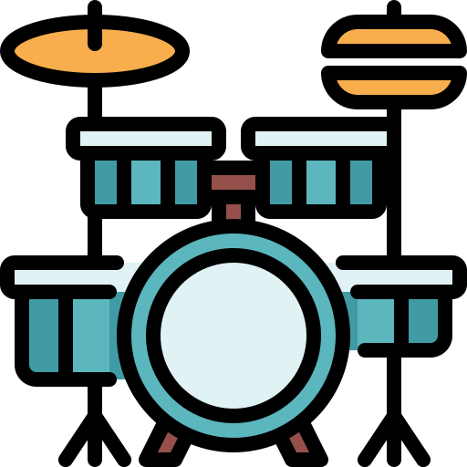

  

    
<h1 align="center">
  <h2 align="center"><strong align="center">Projeto Mini Midi</strong></h2>
   
  <h4 align="center"><strong align="center">(ou Criando páginas dinâmicas)</strong></h4>
</h1>

 

<h2> Descrição </h2>

  O Mini Midi é um instrumento musical de interface digital, onde a cada botão reproduz o som de um instrumento.

   Neste projeto, utilizei alguns recursos atuais do JavaScript, como constantes, variáveis, <code>querySelector</code>, template string, eventos de teclado e de mouse e muito mais.

    Aqui não utilizei recursos avançados do JavaScript, como integração com backend, APIs do navegador, classes e objetos a fundo.

 

<h2> Agradecimentos </h2>

<ul>
  <li><a href="https://www.linkedin.com/in/vanessametonini/" target="_blank"> Vanessa Me Tonini </a></li>
  <li><a href="https://www.alura.com.br/" target="_blank"> Alura </a></li>
</ul>

  
    <adress>
      Icons made by (from <a href="https://www.flaticon.com/br/" target="_blank" title="Flaticon"> Flaticon</a>):
      <ul>
        <li><a href="https://www.flaticon.com/br/autores/freepik" target="_blank" title="Freepik">Freepik</a>;</li>
        <li><a href="https://www.flaticon.com/br/autores/tulpahn" target="_blank" title="tulpahn">tulpahn</a>;</li>
      </ul>
    </adress>
  

 

<h2> Autor </h2>

<table>
  <tr>
    <td align="center"><a href="https://www.linkedin.com/in/vini-antunes/" target="_blank"> <b>Vini Antunes</b></a> </td>
  <tr>
</table>

 

